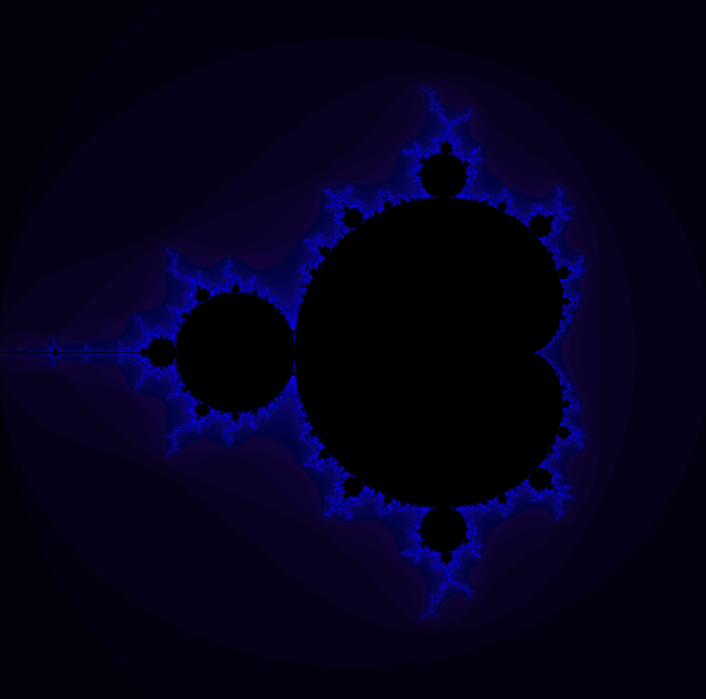
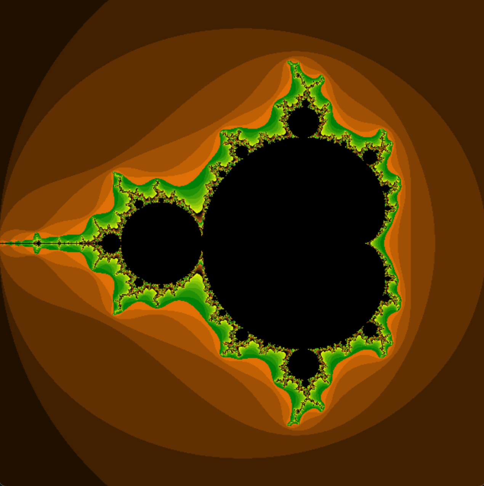

# Boreal-Fractal-Symphony

Generate fractals using algebra and pygame with support for Mandelbrot set.

<h1>Example render:</h1>

Example color = (iterations % 8 * 2, iterations % 16 * 0.4, iterations % 32 * 8) # less red and green, higher blue value

Example color = (iterations % 8 * 32, iterations % 16 * 16, iterations % 32 * 4 * 0.2)
